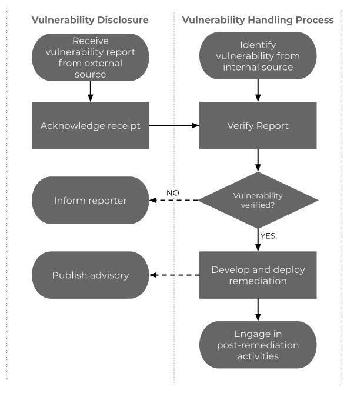
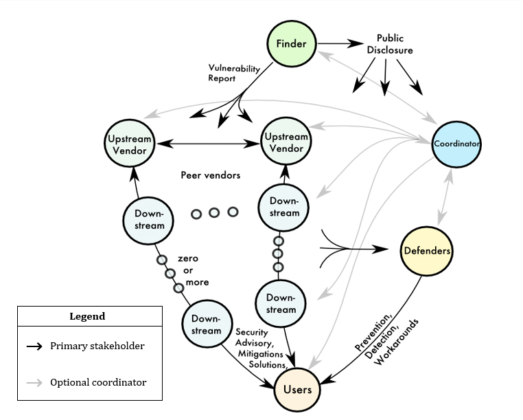

# 🔐 Responsible Disclosure – Liiketoiminnan ja asiakassuhteiden näkökulma

Responsible Disclosure -käytäntö tarkoittaa vastuullista tapaa ilmoittaa tietoturvahaavoittuvuuksista organisaatiolle ennen kuin ne paljastetaan julkisesti. Tämä antaa yrityksille mahdollisuuden korjata ongelmat ennen kuin ne voivat aiheuttaa haittaa.

Yritykset saattavat ottaa tietoturvan vakavasti, ja on olemassa käytäntöjä sekä ohjeistuksia, jotka perustuvat "Responsible Disclosure" -periaatteisiin.

Tämä pätee kaikilla liiketoiminnan osa-alueilla, sillä Responsible Disclosure ei ole enää vain IT:n tai tietoturvan asia, vaan se liittyy suoraan liiketoimintaan ja asiakassuhteisiin. 💼🤝

---

## 🧩 Mitä Responsible Disclosure tarkoittaa myyjille (ja miksi se on heille tärkeää)?

### 🎯 1. Myyjät edustavat yritystä ulospäin
- Kun asiakas kysyy: *"Miten teillä hoidetaan tietoturva? Entä jos löytyy haavoittuvuus?"* → Myyjän pitäisi osata vastata lyhyesti, mutta uskottavasti.
#### 🔐 Esimerkiksi:
  *“Meillä on käytössä Responsible Disclosure -prosessi. Jos asiakas, ulkopuolinen tai vaikka oma työntekijä havaitsee haavoittuvuuden, meillä on ohjeistus ja kanavat, miten siitä ilmoitetaan ja miten se korjataan nopeasti.”*

---

### 🧠 2. Myynti ei ole vain tuotteiden myymistä – vaan myös luottamuksen rakentamista
- 💡 Asiakkaat eivät osta vain palvelua – he ostavat turvallisuutta, vastuullisuutta ja läpinäkyvyyttä.
- 🔍 Jos myyjä osaa kertoa, että "meillä on järjestelmä turvallisten ilmoitusten käsittelyyn, ja kaikki havainnot käsitellään priorisoidusti ja dokumentoidusti", se luo uskoa yrityksen ammattitaitoon.
- 🧾 Asiakas voi haluta nähdä:
  - Tietoturvapolitiikan lyhennelmän.
  - Responsible Disclosure -prosessin kuvauksen.
  - Esimerkin siitä, miten toimitaan, jos haavoittuvuus ilmenee.

---

### 🏗️ 3. Myyjien on tärkeä ymmärtää: miten palvelu rakennetaan ja suojataan
Eli periaatteet:
- Miten palvelu testataan (myös pentestit).
- Miten virheitä etsitään ja korjataan.
- Miten asiakas voi itse osallistua (esim. ilmoittaa haavoittuvuuden).

#### ➡️ Kun myyjä tuntee tuotannon ja kehityksen perusteet, hän pystyy vastaamaan asiakkaan hankaliinkin kysymyksiin.

#### 📣 Esimerkki asiakkaan kysymyksestä ja hyvä vastaus myyjältä:
- **👤 Asiakas kysyy:**  
  *"Entä jos löydän haavoittuvuuden teidän palvelusta, mihin ilmoitan?"*

- **🧑‍💼 Myyjä vastaa (esimerkkimuodossa):**  
  *"Hienoa, että nostatte tämän esiin! Meillä on käytössä Responsible Disclosure -käytäntö. Ilmoituksen voi tehdä tietoturvatiimille osoitteeseen security@meidänfirma.fi tai lomakkeella, ja se menee suoraan käsiteltäväksi. Kaikki tapaukset käsitellään luottamuksella, dokumentoidaan ja korjataan prioriteetin mukaan. Halutessanne voidaan myös sopia vastuullisen ilmoittamisen ohjelmasta asiakassopimuksen yhteydessä."*

---

### 📌 Tiivistettynä:

| **Miksi myyjille tärkeää?**                    | **Miten Responsible Disclosure näkyy heille?**                |
|------------------------------------------------|-------------------------------------------------------------|
| 💼 Asiakas luottaa enemmän, kun tietoturva on hallussa | Myyjän pitää osata kertoa lyhyesti, miten prosessi toimii.   |
| ❓ Asiakkaat kysyvät usein tietoturvasta tarkkoja kysymyksiä | Myyjällä on hyvä olla valmis vastaus ja yhteys tietoturvatiimiin. |
| 🧠 Myynti hyötyy, kun tuntee tuotannon ja riskit | Ymmärtää, miten palvelu toimii “konepellin alla”.            |
| 🔗 Tuo myynti lähemmäksi kehitystä ja IT:tä     | Helpottaa yhteistyötä asiakkaan ja sisäisten tiimien välillä. |

---

## 🔐 Responsible Disclosure & sopimusrakenne – mitä pitää huomioida?

### 📑 1. Sopimukseen kirjataan:

| **Elementti**                     | **Miksi tärkeä?**                                             |
|-----------------------------------|-------------------------------------------------------------|
| 📬 Ilmoituskanavat (kontaktipisteet) | Missä ilmoitetaan haavoittuvuudesta? Sähköposti? Lomake?    |
| ⏱️ SLA / vasteajat                | Miten nopeasti reagoidaan eri vakavuusluokkiin?              |
| ⚙️ Priorisointikriteerit           | Mikä lasketaan kriittiseksi, mikä vähäiseksi?                |
| 🛑 Kielletyt alueet / rajat         | Mihin ei saa testata tai koskea? (esim. maksuliikenne, tuotantoympäristö). |
| 🧾 Valtuutukset                   | Kenellä on lupa tehdä testi, kuka hyväksyy löydöksen käsittelyn? |
| 🔄 Yhteistyöprosessi               | Miten edetään löydöksen jälkeen? Kuka vastaa mistäkin?       |

---

### 🧭 2. SLA & priorisointi käytännössä

| **Prioriteetti** | **Esimerkki tilanteesta**            | **SLA-reaktioaika (esim.)**           |
|------------------|--------------------------------------|---------------------------------------|
| 🟥 Kriittinen    | Käyttäjän data vuotaa tai järjestelmä murtuu | 4h sisällä reaktio, 24h korjaussuunnitelma |
| 🟧 Merkittävä    | Väärin määritetty pääsyoikeus        | 1 vrk reaktio, 3 vrk korjaus          |
| 🟨 Matala        | UI-bugi ilman vaikutusta tietoturvaan | 3-5 vrk reaktio                      |

Tämä määritetään sopimuksessa tai erillisessä tietoturvaliitteessä. ✅

---

### 🧑‍🤝‍🧑 3. Kuka on yhteyshenkilö? Ja kuka saa tehdä mitä?
- **🧑‍💼 Sisäinen yhteyshenkilö:** Yleensä tietoturva, IT tai tietosuojavastaava.
- **📣 Ulkoiselle taholle (esim. asiakas, tutkija, kumppani):**
  - security@firma.fi
  - Lomake esim. firma.fi/security-disclosure
- **🛂 Valtuutukset kirjataan myös sopimukseen:**
  - Saa suorittaa testauksen → Kyllä/Ei
  - Saa käyttää automatisoituja työkaluja? Rajatuilla IP-osoitteilla?
  - Kenelle testin tulokset saa jakaa? (Esim. omalle asiakkaalle, kolmannelle osapuolelle?)

---

### 🧱 4. Entä jos ilmoittaja on “sivullinen” tai ei ole yrityksessä?

✅ Sama vastuullinen toimintamalli pätee:
- Ulkopuolinen tietoturvatutkija.
- Asiakkaan loppukäyttäjä.
- Satunnainen kävijä verkkopalvelussa.
- Konsultti, joka ei ole testiroolissa mutta huomaa jotain.

➡️ Ilmoitus pitää ottaa vastaan vastuullisesti.  
➡️ Tieto ohjataan oikealle henkilölle tai yksikölle.  
➡️ Tarvittaessa käynnistetään normaali Disclosure-prosessi.

---

### 🧩 Yhteenveto:

- 🔗 Responsible Disclosure ei ole erillinen juttu – se kytkeytyy sopimuksiin, vastuisiin ja viestintään.
- 🧑‍💼 Jokaisessa yrityksessä pitäisi olla selkeästi kuvattu: kuka tekee, kuka saa tehdä, miten ilmoitetaan, milloin reagoidaan ja kuka vastaa.
- 🤝 Myynti, lakiosasto, asiakaspalvelu ja muut yksiköt pitää ottaa mukaan, koska asiakas voi kysyä tätä mistä tahansa näkökulmasta.

---

# 🔐 Responsible Disclosure – Välikäden rooli yritysten välisessä yhteistyössä

A yritys → B yritys (välittäjä/toimittaja) → C yritys (B:n asiakkuus)  
Tämä usein tapahtuu, kun B-yritys toimii välittäjänä. Esimerkiksi A-yritys tarvitsee jotakin X-tuotetta, jonka se ostaa B-yritykseltä. B puolestaan hankkii tuotteen C-yritykseltä. Prosessi liittyy SLA-prosesseihin, joissa eri yritysten ja osapuolten välillä tarvitaan koordinaatiota ja vastuunjakoa.

---

## 🧩 Esimerkit vastuuketjun toimintamallista:

1. **Lisenssikauppa:**  
   - A-käyttäjä (yritys) ostaa lisenssin B-yritykseltä hintaan 8 €.  
   - B-yritys ostaa saman lisenssin C-yritykseltä hintaan 7 €.  
   - Näin B-yritys ansaitsee yhden euron voittomarginaalin.

2. **Hyväksyntäprosessin koordinointi:**  
   - A-yritys pyytää jotakin palvelua/tuotetta C-yritykseltä.  
   - Koska hankinta ja kommunikointi kulkee B-yrityksen kautta, B ei voi edetä ilman A:lta tulevaa hyväksyntää.  
   - A-yritys pyytää C-yritykseltä vahvistuksen esimerkiksi lomakkeella, valtuutetulla asiakirjalla tai valtakirjalla.  
   - Tämä mahdollistaa B-yrityksen etenemisen sääntöjen ja sopimusten mukaisesti.

---

## 🧩 Miten Responsible Disclosure vaikuttaa välikätenä toimivaan yritykseen (B)?

### 🔁 Vastuunjako kahteen suuntaan

#### 1️⃣ **Vastuu omassa päässä (B-yritys):**
- B-yrityksen oma Responsible Disclosure -prosessi käynnistetään heti:
  - **Ilmoitus:** Omalle tietoturvatiimille tai vastuuhenkilölle.  
  - **Arvio:** Selvitetään, liittyykö havaittu haavoittuvuus vain B:hen vai myös C:hen (asiakas).
- Kaikki dokumentointi ja viestintä tehdään huolellisesti, koska se vaikuttaa asiakkaan luottamukseen.

#### 2️⃣ **Vastuu eteenpäin (C-yritys / asiakas):**
- Jos haavoittuvuus tai riski vaikuttaa C-yrityksen tietoihin, järjestelmiin tai asiakkaille näkyvään palveluun, B-yrityksen on velvollisuus ilmoittaa siitä asiakkaalle (C:lle).  
  ⚠️ Tämä määritellään usein sopimuksessa tai vastuuroolissa.

---

### 📬 Miten ja kenelle ilmoitetaan?

| Tilanne                                  | Kuka ilmoittaa?                  | Kenelle ilmoitetaan?                                |
|------------------------------------------|----------------------------------|---------------------------------------------------|
| 🔍 Haavoittuvuus B:n omassa järjestelmässä | B:n tietoturva/projektipäällikkö | C:n yhteyshenkilölle tai tietoturvatiimille       |
| 🛠️ Haavoittuvuus liittyy C:n järjestelmään, jota B operoi | B ilmoittaa C:lle                 | C tekee oman sisäisen Disclosure-prosessin        |
| ⚠️ Riskihavainto liittyy kolmannen osapuolen teknologiaan | B arvioi, C:lle ilmoitetaan varotoimena | Mahdollisesti tiedotetaan laajemmin               |

---

### 🛑 Miksi tämä on tärkeää?

- Jos B-yritys ei ilmoita asiakkaalle C:lle löydöksestä, vaikka se koskee C:n dataa:
  - Luottamus voi romahtaa.
  - C voi saada tiedon ongelmasta muualta, mikä voi johtaa:
    - Sopimuksen purkamiseen.
    - Mainehaittaan.
    - Vastuukysymyksiin (GDPR jne.).

---

## 👥 Välikäsiroolissa muistettavaa:

✅ **Välikäsi (toimittaja, integraattori, operaattori):**
- Vastaa sekä ylöspäin että alaspäin – eli omalle johdolle että asiakkaalle.
- Ei saa viivyttää tietoa eikä pimittää, vaikka se olisi "epämukava" tieto.
- Dokumentoi havainnot, toimenpiteet ja ilmoitukset – tämä suojaa myöhemmin.

---

### 🧠 Yhteenveto:

- 🧩 Jos yritys toimii toimittajana tai välikätenä, sen vastuulla on sekä oma Disclosure-prosessi että asiakkaan informointi.
- 🔁 Viestintä kulkee kahteen suuntaan: sisäisesti ja asiakkaalle.
- 📄 Sopimuksessa pitäisi näkyä: kuka ilmoittaa, milloin, mitä tietoa, ja miten.
- 🔐 Vastuullisuus ei lopu siihen, että "meillä on tieto" – se alkaa siitä.

Pieni visuaalinen malli, joka havainnollistaa vastuuketjun ja viestintäprosessin Responsible Disclosure -tilanteessa, erityisesti silloin, kun yritys toimii välikätenä (toimittajana) asiakkaan ja loppukäyttäjän välillä.

Tämän ylemmän kuvan havaintoa ja siitä vähä kuvausta:

## 📌 Avainkohdat vastuuketjussa:

- **Ilmoittaja (Finder):** Havaitsee haavoittuvuuden ja ilmoittaa siitä.
- **Välittäjä / Toimittaja (B):** Vastaa ilmoituksen vastaanottamisesta, arvioinnista ja tarvittaessa edelleen välittämisestä asiakkaalle (C).
- **Asiakas (C):** Arvioi, miten haavoittuvuus vaikuttaa heidän järjestelmiinsä ja asiakkailleen.
- **Loppukäyttäjä (D):** Saattaa olla suoraan yhteydessä ilmoittajaan tai toimittajaan saadakseen lisätietoja.
- **Kolmas osapuoli (E):** Voi olla mukana, jos haavoittuvuus vaikuttaa useisiin järjestelmiin tai ekosysteemeihin.

## 📌 Tärkeitä huomioita:

- **Sopimukset ja vastuut:** On tärkeää, että kaikki osapuolet ymmärtävät omat vastuunsa ja velvoitteensa.
- **Viestintäkanavat:** Käytettävät kanavat (esim. sähköposti, Teams, puhelin) tulee määritellä etukäteen.
- **Aikarajat:** Aikarajat ilmoituksille ja toimenpiteille tulisi olla selkeästi määriteltyjä.
- **Dokumentointi:** Kaikki vaiheet tulisi dokumentoida asianmukaisesti mahdollisten jälkikäteisten tarkastelujen varalta.

